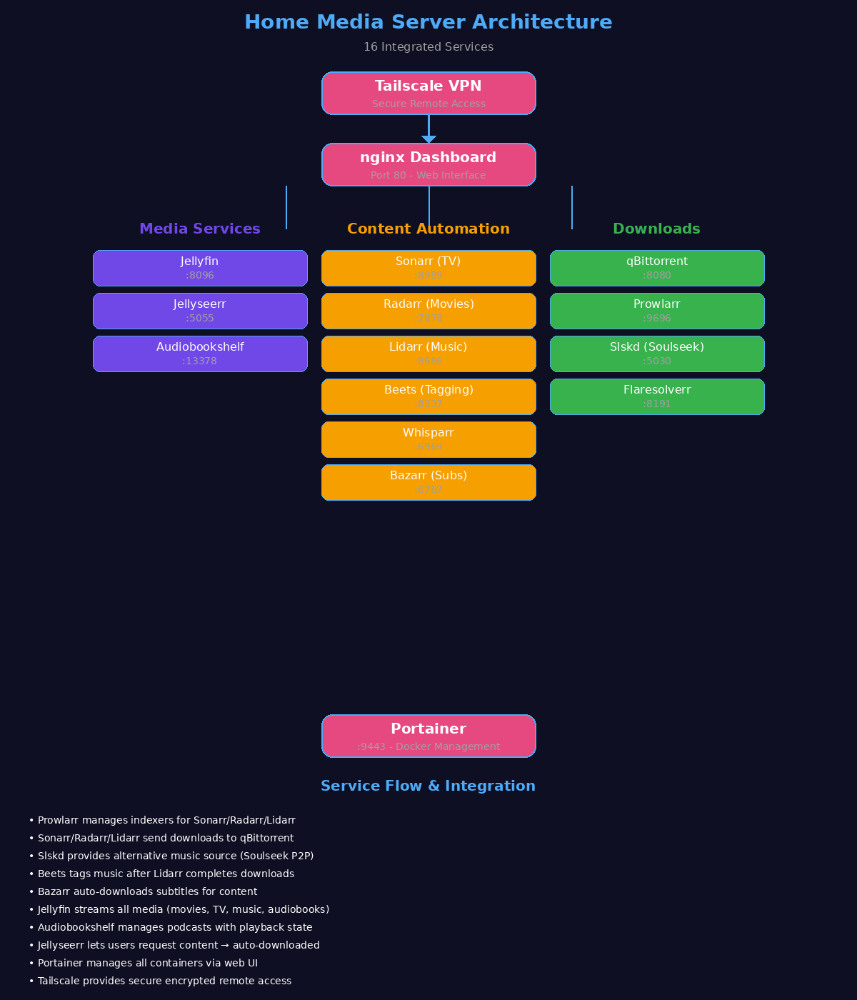

# 🏠 Home Media Server

<div align="center">
    
    <br><em>Complete integrated media server architecture</em>
    
[](https://opensource.org/licenses/Apache-2.0)
[](https://www.docker.com/)
[](CONTRIBUTING.md)

**Complete Docker-based home media server featuring Jellyfin for streaming, automated content management, torrent/Soulseek downloads, podcast/audiobook tracking, professional music tagging, and secure remote access via Tailscale VPN.**

[Quick Start](#-quick-start) • [Features](#-features) • [Setup Guide](SETUP_GUIDE.md) • [Contributing](CONTRIBUTING.md)

</div>


---

## ✨ Features

- 🎬 **Stream Movies & TV Shows** with Jellyfin
- 🎵 **Music, Audiobooks & Podcasts** all in one place
- 🤖 **Automated Downloads** for TV shows, movies, and music
- 📱 **Mobile Apps** for iOS and Android
- 🔒 **Secure Remote Access** via Tailscale VPN
- 🐳 **Easy Deployment** with Docker Compose
- 🎨 **Beautiful Dashboard** for managing all services

## 🚀 Quick Start

```bash
# 1. Clone repository
git clone https://github.com/AhutGupta/home-media-server.git
cd home-media-server/compose_files

# 2. Configure environment
cp .env.example .env
nano .env  # Edit with your settings

# 3. Start all services
docker-compose up -d

# 4. Open dashboard
open http://localhost/
```

**Next Steps**: Follow the [Setup Guide](SETUP_GUIDE.md) to configure each service.

## 📦 What's Included

### Media Streaming
- **Jellyfin** (Port 8096) - Stream movies, TV, music, audiobooks, podcasts
- **Jellyseerr** (Port 5055) - User-friendly content requests
- **Audiobookshelf** (Port 13378) - Podcasts & audiobooks with perfect state tracking

### Content Automation
- **Sonarr** (Port 8989) - TV show management and downloads
- **Radarr** (Port 7878) - Movie management and downloads
- **Lidarr** (Port 8686) - Music management with ID3 tagging
- **Beets** (Port 8337) - Professional music tagging with MusicBrainz
- **Whisparr** (Port 6969) - Adult content (optional)
- **Bazarr** (Port 6767) - Automatic subtitle downloads

### Download Management
- **qBittorrent** (Port 8080) - Torrent client
- **Prowlarr** (Port 9696) - Unified indexer manager
- **Slskd** (Port 5030) - Soulseek for rare/obscure music
- **Flaresolverr** (Port 8191) - Cloudflare bypass

### Infrastructure
- **nginx** (Port 80) - Dashboard and reverse proxy
- **Portainer** (Port 9443) - Container management with web UI
- **Tailscale** - Secure VPN for remote access

**All services** work together seamlessly to provide a complete media management and streaming solution.


## 🌐 Access Your Media Server

### From the Host Machine
```
http://localhost/           # Dashboard
http://localhost:8096/      # Jellyfin
http://localhost:7878/      # Radarr
http://localhost:8989/      # Sonarr
```

### From Local Network
Replace `localhost` with your server's IP address:
```
http://192.168.1.100/       # Dashboard
http://192.168.1.100:8096/  # Jellyfin
```

### Remote Access (via Tailscale)
With Tailscale connected:
```
http://media-server:8096/       # Using hostname
http://100.x.x.x:8096/         # Using Tailscale IP
```

> **Note**: The `media-server` hostname works automatically with Tailscale's MagicDNS.

## 📱 Mobile Apps

### Jellyfin
- **iOS**: [App Store](https://apps.apple.com/app/jellyfin-mobile/id1480192618)
- **Android**: [Google Play](https://play.google.com/store/apps/details?id=org.jellyfin.mobile)
- **Server URL**: `http://192.168.x.x:8096` (local) or `http://media-server:8096` (Tailscale)

### qBittorrent Remote
- Various apps available for iOS and Android
- **Server**: `192.168.x.x:8080` or `media-server:8080`
- **Credentials**: Set in qBittorrent web UI

## 🛠️ Configuration

### Essential Setup
1. **qBittorrent**: Change default password (admin/adminadmin)
2. **Prowlarr**: Add indexers for content search
3. **Sonarr/Radarr/Lidarr**: Connect to Prowlarr and qBittorrent
4. **Jellyfin**: Add media libraries
5. **Jellyseerr**: Connect to Jellyfin and *arr apps

**Detailed Instructions**: See [SETUP_GUIDE.md](SETUP_GUIDE.md) for step-by-step configuration.

## 🔐 Security & Privacy

This server is designed for **personal use** with your **legally obtained content**:
- ✅ Personal backups and DVR recordings
- ✅ Home videos and photos
- ✅ Podcasts and audiobooks
- ✅ Legally purchased or licensed media

**Security Features**:
- All services run on localhost by default
- Tailscale provides encrypted remote access
- No port forwarding required
- Apache 2.0 licensed with patent protection

## ⚖️ Legal Notice

This project provides infrastructure tools for managing personal media libraries.

- All software used is open source and legally distributed
- This is for managing YOUR OWN legally obtained content
- Users are responsible for complying with copyright laws
- Intended for personal backups, DVR recordings, home videos, podcasts, etc.
- This project does not endorse or support copyright infringement

See [LICENSE](LICENSE) for full terms.

## 🐳 Docker Configuration

### Standard Installation
```bash
docker-compose up -d
```

### Nvidia GPU Support (Optional)

For hardware transcoding in Jellyfin with Nvidia GPUs:

```bash
# Use nvidia compose file instead of standard
docker-compose -f docker-compose-nvidia.yaml up -d
```

**Prerequisites:**
- Nvidia GPU (GTX 1050+ or newer recommended)
- [Nvidia Container Toolkit](https://docs.nvidia.com/datacenter/cloud-native/container-toolkit/install-guide.html) installed
- Nvidia drivers installed on host system

**Benefits:**
- Hardware transcoding (much faster than CPU)
- 4K streaming with minimal CPU usage
- Multiple simultaneous streams
- Faster thumbnail generation

**Setup Steps:**
1. Install Nvidia drivers on your system
2. Install Nvidia Container Toolkit
3. Use `docker-compose-nvidia.yaml` instead of standard compose file
4. Enable hardware acceleration in Jellyfin: Dashboard → Playback → Hardware Acceleration

## 📚 Documentation

- **[Setup Guide](SETUP_GUIDE.md)** - Detailed configuration for each service
- **[Contributing](CONTRIBUTING.md)** - How to contribute to this project
- **[Security Policy](SECURITY.md)** - Reporting security issues
- **[License](LICENSE)** - Apache 2.0 License terms

## 🤝 Contributing

Contributions are welcome! Please see [CONTRIBUTING.md](CONTRIBUTING.md) for:
- How to report bugs
- How to suggest features
- Development guidelines
- Code review process

## 🆘 Troubleshooting

### Services Won't Start
```bash
# Check logs
docker-compose logs <service-name>

# Restart service
docker-compose restart <service-name>

# Rebuild containers
docker-compose up -d --force-recreate
```

### Can't Access Services
- Verify services are running: `docker-compose ps`
- Check firewall settings
- Ensure ports aren't already in use
- For Tailscale: Verify VPN connection

### Performance Issues
- Check resource usage in Portainer
- Increase RAM allocation for Docker
- Use SSD for Docker volumes
- Enable GPU transcoding (Nvidia)

**More Help**: See [SETUP_GUIDE.md](SETUP_GUIDE.md) for detailed troubleshooting.

## 📊 Architecture

```
┌─────────────────────────────────────────────────────────────┐
│                        nginx (Port 80)                       │
│                    Dashboard & Reverse Proxy                 │
└─────────────────────────────────────────────────────────────┘
                              │
        ┌─────────────────────┼─────────────────────┐
        │                     │                     │
┌───────▼──────┐    ┌────────▼────────┐   ┌───────▼────────┐
│   Jellyfin   │    │   Jellyseerr    │   │   Portainer    │
│ Media Stream │    │Content Requests │   │Container Mgmt  │
│   :8096      │    │     :5055       │   │    :9443       │
└──────────────┘    └─────────────────┘   └────────────────┘
                              │
        ┌─────────────────────┼─────────────────────┐
        │                     │                     │
┌───────▼──────┐    ┌────────▼────────┐   ┌───────▼────────┐
│    Sonarr    │    │     Radarr      │   │    Lidarr      │
│  TV Shows    │    │     Movies      │   │     Music      │
│   :8989      │    │     :7878       │   │    :8686       │
└───────┬──────┘    └────────┬────────┘   └───────┬────────┘
        │                    │                    │
        └────────────────────┼────────────────────┘
                             │
                    ┌────────▼────────┐
                    │    Prowlarr     │
                    │Indexer Manager  │
                    │     :9696       │
                    └────────┬────────┘
                             │
                    ┌────────▼────────┐
                    │   qBittorrent   │
                    │ Download Client │
                    │     :8080       │
                    └─────────────────┘
```

## 🌟 Star History

If you find this project useful, please consider giving it a star! ⭐

## 📝 Changelog

See [Releases](https://github.com/AhutGupta/home-media-server/releases) for version history and changes.

## 📧 Support

- **Issues**: [GitHub Issues](https://github.com/AhutGupta/home-media-server/issues)
- **Discussions**: [GitHub Discussions](https://github.com/AhutGupta/home-media-server/discussions)

## 📜 License

Copyright © 2024-2026 AhutGupta and Contributors

Licensed under the Apache License, Version 2.0. See [LICENSE](LICENSE) for details.

---

<div align="center">

**Built with ❤️ for the self-hosted community**

</div>
